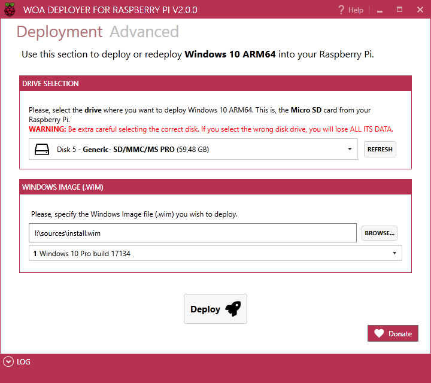

# WOA Deployer for Raspberry Pi 3

The application to install Full Windows 10 into your Raspberry Pi!

# **Super easy to use. No-hassle.**

Please keep reading carefully. All you need is here.

# Requirements
- Raspberry Pi 3 Model B (or B+)
- MicroSD card. Recommended with A1 rating.
- A Windows 10 ARM64 Image (.wim). Please, check [this link](https://github.com/WOA-Project/guides/blob/master/GettingWOA.md) to get it.

### Additional requirements
- To run WOA Deployer you need a recent version of Windows 10 (please, use the latest to ensure it'll run correctly, don't open issues otherwise)
- .NET Framework 4.6.1 (should come included in recent versions of Windows)

# Download it

Download the **[latest version](https://github.com/WOA-Project/WOA-Deployer-Rpi/releases/latest)** 

# Executing the tool
1. Extract the .zip to a folder in your PC
2. Navigate to the GUI folder
3. Find the .exe file
4. Run it

# Show the love 🧡

Do you like my tool? Has it been useful for you?
Then, I hope you [👉 support my work](Docs/Donations.md)

## Donate to the contributors of this project
Please, don't forget that the RaspberryPi WOA Project is supported by other individuals and companies (see the [credits and acknowledgements section](#credits-and-acknowledgements
)).
 - Donate to [MCCI](https://mcci.com/). Why? [Read this 🗒](Docs/mcci_donate.md) 

# Need help?
Then visit our projects website at https://pi64.win, the one-stop solution for all your questions 😊

It's also recommended that you read the [FAQ 📘](https://pi64.win/)
And, of course, don't hesitate to join our great [Telegram group 📱](https://t.me/joinchat/ACWtm01aRdQuRAu1d3kW7Q)

# Credits and Acknowledgements

This WOA Deployer is possible because the great community behind it. I would like to thank the brilliant minds behind this technical wonder. If you think you should be listed, please, contact me using the e-mail address on my profile.

- [Andrei Warkentin](https://github.com/andreiw) for the **64-bit Pi UEFI**, UEFI Pi (HDMI, USB, SD/MMC) drivers, improved ATF and Windows boot/runtime support.
- [MCCI](https://mcci.com/) for their great contribution to the RaspberryPI WOA project:
  - for porting their **TrueTask USB stack** to Windows 10 ARM64, and allowing non-commercial use with this project ([see license](Docs/mcci_license.md))
  - for funding the site of the project http://pi64.win and the discourse site http://discourse.pi64.win
  - Special thanks to Terry Moore for all the great support and commitment, and for setting up the online presence for the project and its infrastructure.
- [Ard Bisheuvel](http://www.workofard.com/2017/02/uefi-on-the-pi/) for initial ATF and UEFI ports
- [Googulator](https://github.com/Googulator) for his method to install WOA in the Raspberry Pi
- Bas Timmer ([@NTauthority](https://twitter.com/ntauthority)) for leaving ample thick hints that led to the development of HypDXe and the first bootable WOA builds
- Microsoft for their original [32-bit UEFI for Pi](https://github.com/ms-iot/RPi-UEFI), [Windows BSP drivers](https://github.com/ms-iot/rpi-iotcore), and for removing the HAL check that required HypDxe in the first place, so now we can run any new build.
- Mario Bălănică for his [awesome tool](https://www.worproject.ml), and for tips and support :)
	- daveb77
    - thchi12
    - falkor2k15
    - driver1998
    - XperfectTR
    - woachk
    - novaspirit
    - zlockard 
     
    ...for everything from ACPI/driver work to installation procedures, testing and so on.
- Microsoft for the 32-bit IoT firmware.

In addition to:

- [Ian Johnson](https://github.com/ipjohnson) for his wonderful DI-IOC container: [Grace](https://github.com/ipjohnson/Grace)
- [Eric Zimmerman](https://github.com/EricZimmerman) for [The Registry Project](https://github.com/EricZimmerman/Registry)
- [Jan Karger](https://github.com/punker76) for his wonderful [MahApps.Metro](https://mahapps.com)
- [ReactiveUI](https://reactiveui.net)
- [Adam Hathcock](https://github.com/adamhathcock) for [SharpCompress](https://github.com/adamhathcock/sharpcompress)
- [Etcher](https://www.balena.io/etcher/), the perfect tool for flashing.

And our wonderful group at Telegram for their testing and support!
- [RaspberryPiWOA](https://t.me/raspberrypiwoa)

## Related projects
These are the related projects. The Core Packages comes from them. Big thanks!

- [RaspberryPiPkg](https://github.com/andreiw/RaspberryPiPkg)
- [Microsoft IoT-BSP](https://github.com/ms-iot/bsp)
- [Raspberry Pi ATF](https://github.com/andreiw/raspberry-pi3-atf)
- [WOR Project](https://www.worproject.ml) by [Mario Bălănică](https://github.com/mariobalanica)
